# System Architecture Diagrams

This document visually represents the high-level architecture mapped out for the **Roaya** application.

## High-Level System Architecture

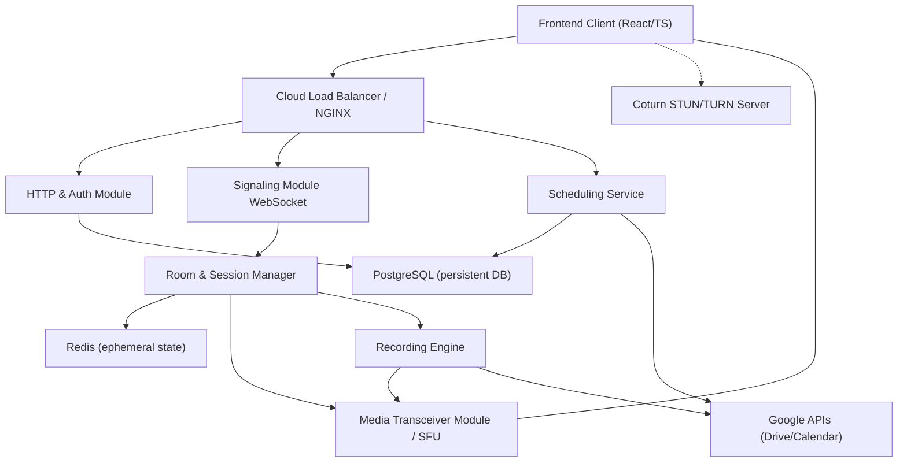

## Internal C++ Module Layout 

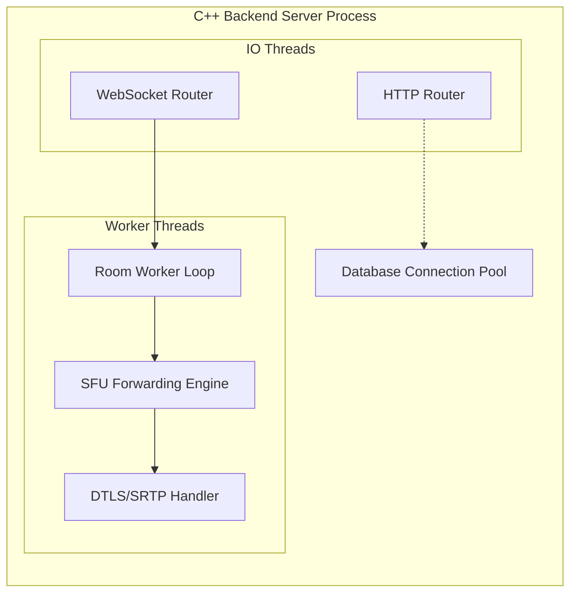

## Backend Class Diagram

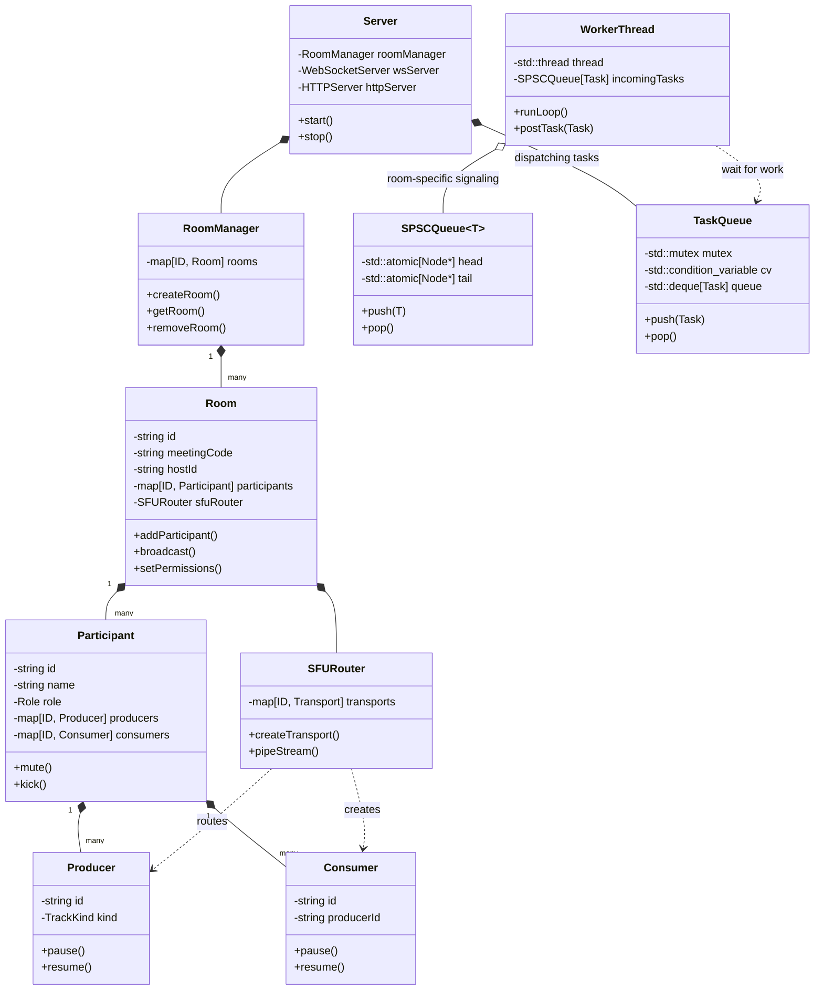

## SFU WebRTC Flow

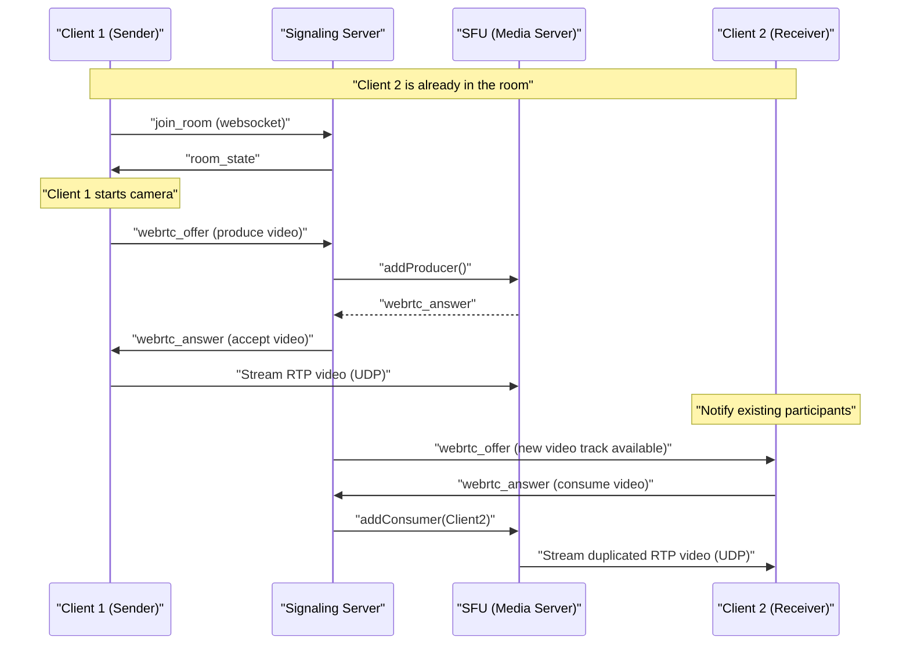

## User Registration & Login Flow

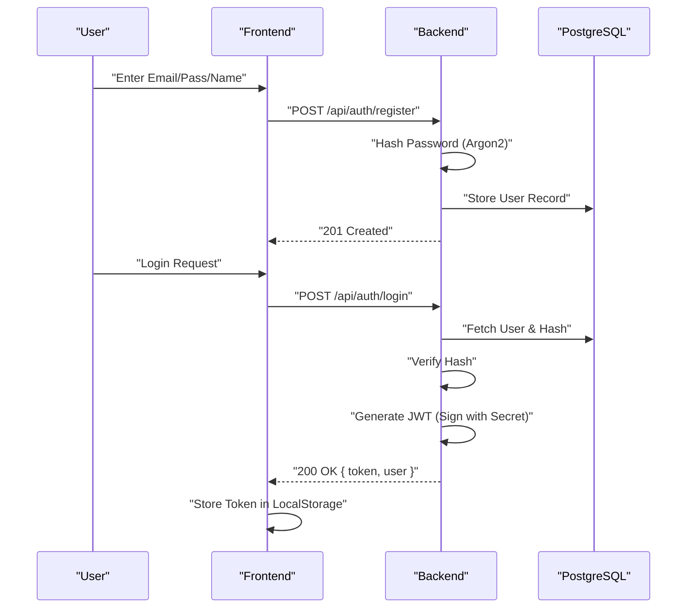

## Joining via Meeting Code / Link

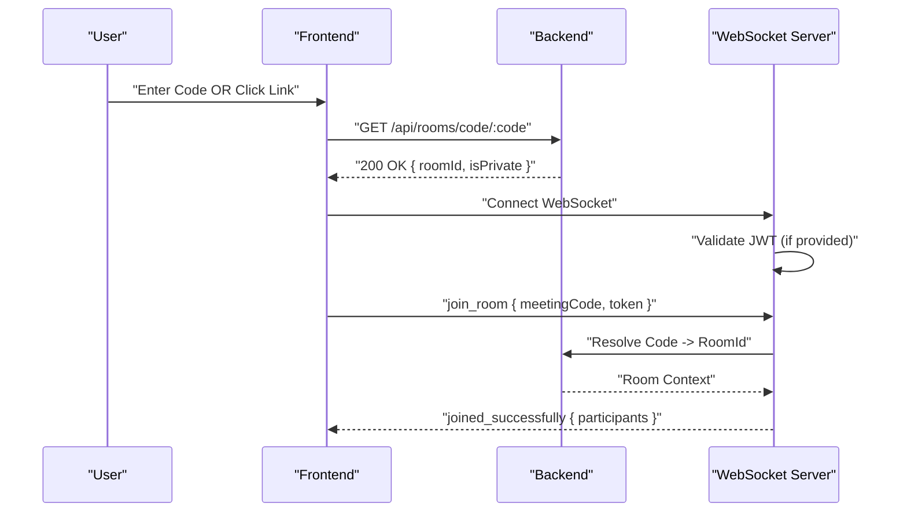

## Host Control Transfer Flow

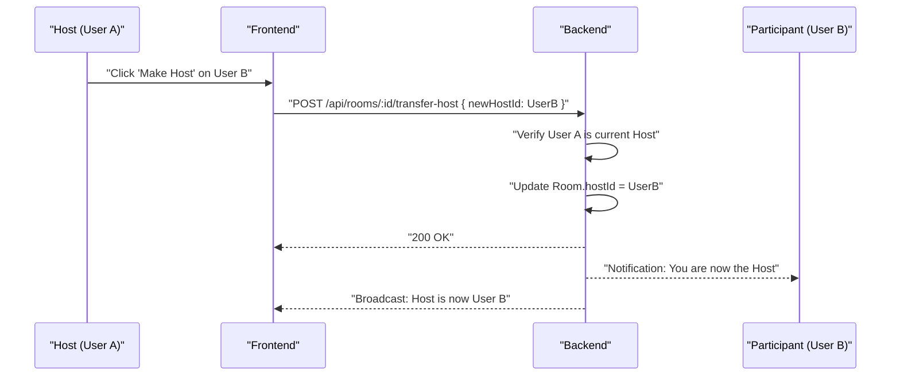

## Cloud Recording Flow

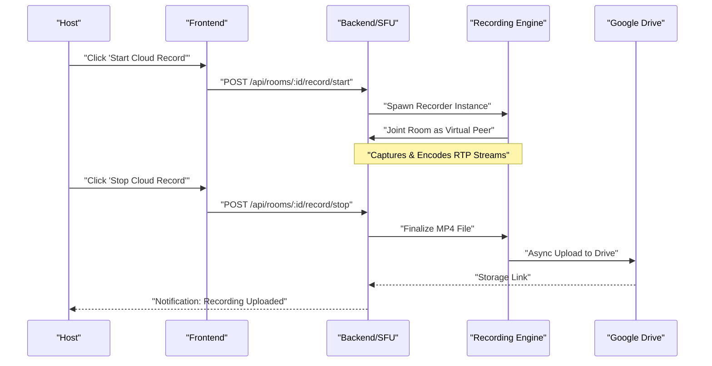

## Dynamic Storage Configuration Flow

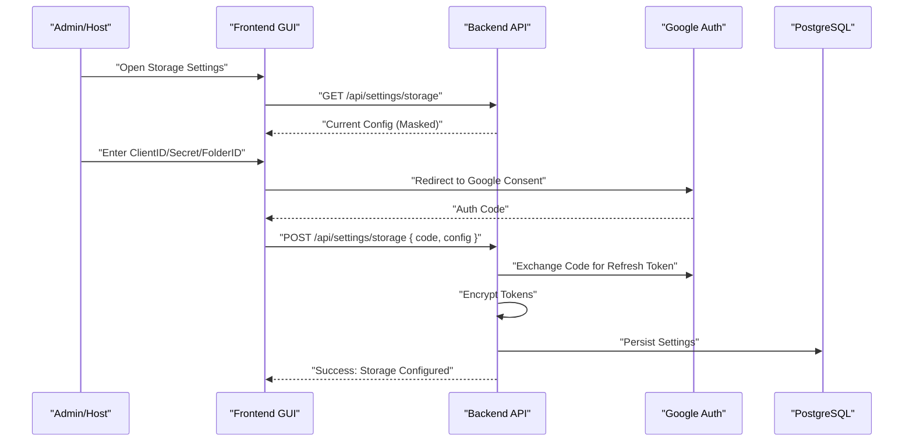

## Meeting Scheduling & Google Calendar Flow

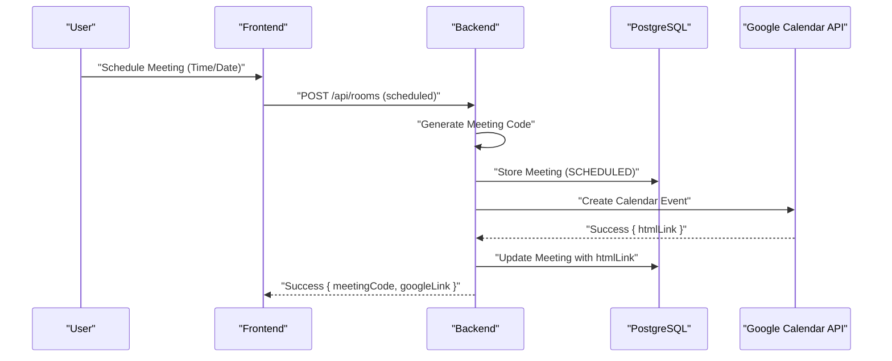

## Screen Sharing Flow

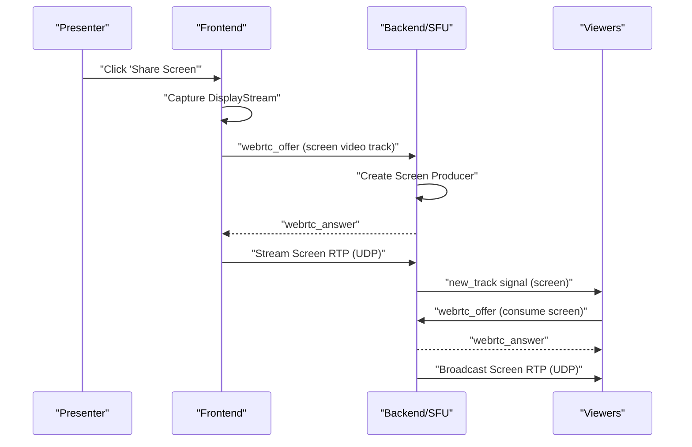

## Host Management: Kick & Mute

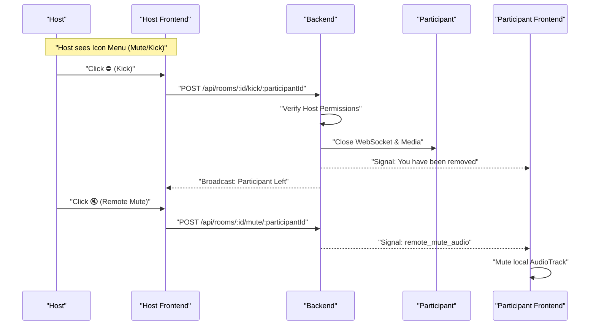

## Remote Control Flow

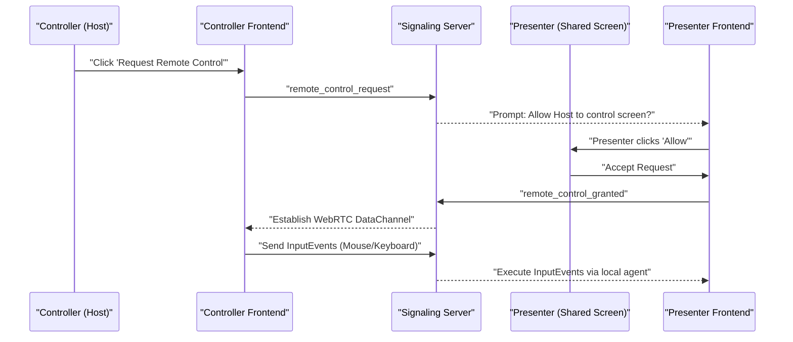
